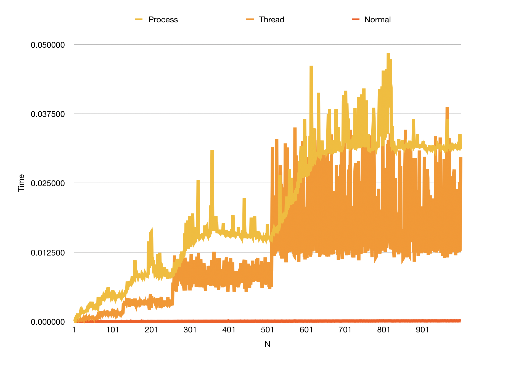

### Problem 1 
#### Findings 
- Both multiprocess and multithreaded merge sorts are way slower than single threaded version if i dont limit the depth of the multithread mergesort to 3
- This can be attributed to time taken to context switch and forking new process or creating a thread is much longer 
than the parallelism gains if any
- For n > 2000 multi process mergeSort fails to sort properly as forking of new process fails. To remedy this I hava put
a fallback to normal mergeSort in such cases.
- Multithread mergeSort also tends to fail for cases of n > 10000 on my system, as system cannot allocate more threads.
- To deal with this I am only creating threads till depth 3 in mergesort. This makes it faster than 1e6 than normal mergesort by upto 75%

       
